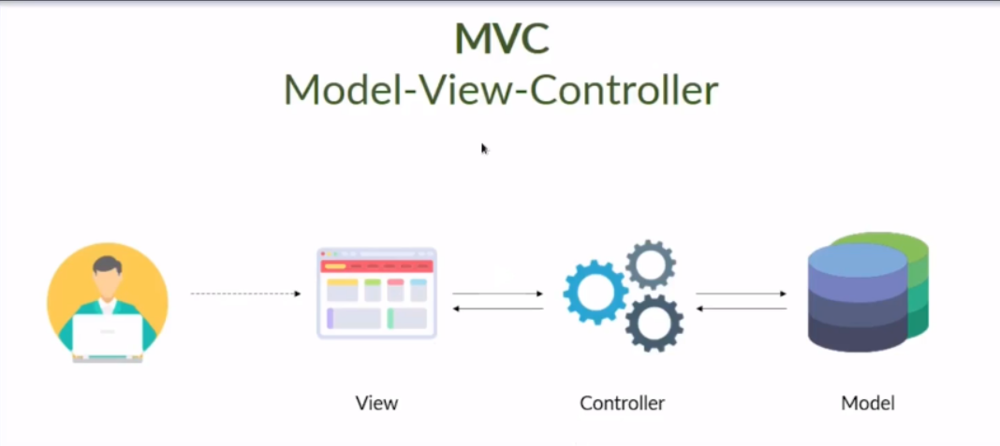

  

## 📌 Introdução

O padrão MVC (Model-View-Controller) foi introduzido originalmente por **Trygve Reenskaug**, engenheiro de software norueguês, em 1978.

Ele apresentou o padrão no artigo:

> *"Applications Programming in Smalltalk-80: How to use Model-View-Controller"*

Desde então, o MVC se tornou uma das arquiteturas mais utilizadas no desenvolvimento de sistemas com interface do usuário e lógica de negócio.

## ❓ O que é MVC?

O MVC é um padrão arquitetural que separa as responsabilidades da aplicação em três componentes principais:

- **Model (Modelo)**
- **View (Visão)**
- **Controller (Controlador)**

Essa separação melhora:

- Organização do código
- Manutenção
- Escalabilidade
- Testabilidade
- Baixo acoplamento
- Alta coesão

## 🔄 Fluxo do MVC

Usuário → View → Controller → Model  
Model → Controller → View → Usuário

Ou de forma simplificada:

## 🧩 Responsabilidades do MVC

### 🎨 View

- Apresenta os dados ao usuário
- Responsável pela interface
- Não contém regra de negócio

### 🎮 Controller

- Recebe as entradas do usuário pela View
- Processa as requisições
- Aplica regras de negócio
- Atualiza o Model quando necessário

### 🗄 Model

- Gerencia os dados da aplicação
- Contém regras de negócio
- Interage com banco de dados
- Fornece métodos para manipulação dos dados

## 🔍 Comparação: Django (MVT) vs MVC

Alguns frameworks utilizam estruturas semelhantes ao MVC.

### Django usa MVT (Model-View-Template)

| MVT (Django) | Equivalente em MVC |
|--------------|--------------------|
| Model        | Model              |
| View         | Controller         |
| Template     | View               |

No Django:

- A **View** funciona como o Controller
- O **Template** funciona como a View
- O **Model** permanece igual

## 🌍 Frameworks que utilizam MVC ou variações

- Django (MVT)
- Spring Boot
- Laravel
- Ruby on Rails
- ASP.NET MVC
- Express (Node.js)

## 🚀 Benefícios do MVC

✔ Separação clara de responsabilidades  
✔ Facilita manutenção e evolução do sistema  
✔ Melhor organização do código  
✔ Reutilização de componentes  
✔ Facilita testes unitários  

## 📚 Conclusão

O padrão MVC é uma das bases da arquitetura de software moderna.  
Sua separação entre interface, controle e dados permite construir sistemas mais organizados, escaláveis e fáceis de manter.

É amplamente adotado por frameworks modernos e continua sendo fundamental no desenvolvimento web e desktop.
